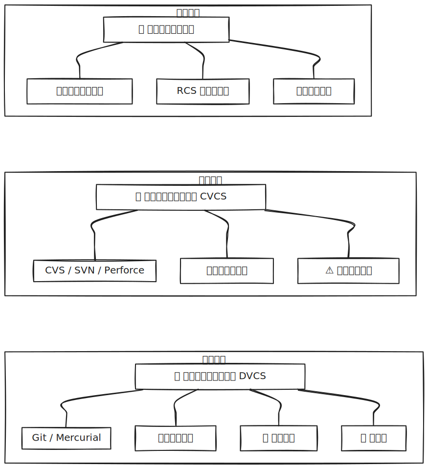

# [0010. 版本控制简介](https://github.com/tnotesjs/TNotes.git-notes/tree/main/notes/0010.%20%E7%89%88%E6%9C%AC%E6%8E%A7%E5%88%B6%E7%AE%80%E4%BB%8B)

<!-- region:toc -->

- [1. 🎯 本节内容](#1--本节内容)
- [2. 🫧 评价](#2--评价)
- [3. 🤔 什么是版本控制？](#3--什么是版本控制)
- [4. 🤔 版本控制经历了哪些发展阶段？](#4--版本控制经历了哪些发展阶段)
  - [4.1. 本地版本控制系统](#41-本地版本控制系统)
  - [4.2. 集中式版本控制系统（CVCS）](#42-集中式版本控制系统cvcs)
  - [4.3. 分布式版本控制系统（DVCS）](#43-分布式版本控制系统dvcs)
- [5. 🤔 Git 是如何诞生的，有哪些核心特点？](#5--git-是如何诞生的有哪些核心特点)
- [6. 🤔 为什么要使用 Git？](#6--为什么要使用-git)
- [7. 🔗 引用](#7--引用)

<!-- endregion:toc -->

## 1. 🎯 本节内容

- 什么是版本控制
- 版本控制的发展史（本地、集中式、分布式）
- Git 的诞生与特点（速度、分布式、数据完整性）
- 为什么要使用 Git

## 2. 🫧 评价

版本控制（Version Control）是一个比较基础的概念，想要理解 Git 是什么，就必需理解什么是版本控制。

Git 是一个分布式的版本控制工具，除了 Git 之外，还有很多其它的版本控制工具，不过目前（26.03）来看，主流的还是 Git。

从笔记中提到的版本控制的三个阶段：本地 -> 集中式 -> 分布式，你会发现其实最初版本控制也是从最原始的手动复制目录来备份文件来实现的，想要深入了解 Git 是如何诞生的，版本控制工具是如何一步步迭代到当前的状态的，可自行查阅版本控制的相关历史。

## 3. 🤔 什么是版本控制？

版本控制（Version Control）是一种记录文件内容变化的系统，它让你可以在未来查阅特定版本的修订情况。无论是个人项目还是团队协作，版本控制都是软件开发中不可或缺的基础工具。

版本控制的核心能力：

- 记录历史：保存文件的每一次修改，随时可以回溯
- 多人协作：多名开发者可以同时修改同一个项目而互不影响
- 分支管理：可以同时维护多条开发线路，互不干扰
- 恢复能力：误删文件或引入 bug 时，可以快速恢复到之前的状态

## 4. 🤔 版本控制经历了哪些发展阶段？

版本控制大致经历了三个阶段：本地 -> 集中式 -> 分布式

| 阶段           | 代表工具       | 核心特点           | 主要问题     |
| -------------- | -------------- | ------------------ | ------------ |
| 本地版本控制   | RCS            | 本地数据库记录差异 | 容易混淆版本 |
| 集中式版本控制 | CVS、SVN       | 中央服务器统一管理 | 单点故障风险 |
| 分布式版本控制 | Git、Mercurial | 完整仓库克隆       | 无单点故障   |

### 4.1. 本地版本控制系统

最早的做法是手动复制目录来备份文件，但容易混淆版本。

后来出现了如 RCS 这样的本地版本控制工具，使用本地数据库记录文件的差异补丁。

### 4.2. 集中式版本控制系统（CVCS）

代表工具有 CVS、Subversion（SVN）、Perforce 等。

所有版本数据都存储在一台中央服务器上，开发者从服务器检出文件进行开发。

优点是便于管理，缺点是中央服务器一旦宕机，所有人都无法工作，且存在单点故障风险。

### 4.3. 分布式版本控制系统（DVCS）

代表工具有 Git、Mercurial 等。

每个开发者都完整克隆整个仓库（包括全部历史记录），即使服务器故障，任何一个本地仓库都可以用于恢复。

这种模式下，开发者可以离线工作，速度更快且更加安全。

## 5. 🤔 Git 是如何诞生的，有哪些核心特点？

Git 由 Linux 内核的创建者 Linus Torvalds 于 2005 年开发。此前 Linux 内核使用 BitKeeper 进行版本管理，但由于许可争议，Linus 决定自行开发一套版本控制系统。

Git 的设计目标和核心特点：

- 速度快：几乎所有操作都在本地完成，不依赖网络
- 分布式架构：每个开发者都拥有完整的仓库副本
- 数据完整性：使用 SHA-1 校验和确保数据不会损坏或丢失
- 支持非线性开发：强大的分支和合并机制，适合大规模并行开发
- 高效存储：Git 以快照（snapshot）方式存储数据，而非传统的差异存储

## 6. 🤔 为什么要使用 Git？

Git 是目前最流行的版本控制系统，几乎是现代软件开发的标配。选择 Git 的主要理由包括：

- 行业标准：GitHub、GitLab、Gitee 等主流平台均基于 Git
- 离线工作：无需网络连接即可进行提交、查看历史、创建分支等操作
- 分支成本低：创建和切换分支几乎是瞬间完成的，鼓励频繁使用分支
- 社区庞大：拥有丰富的工具链、文档和社区支持
- 开源免费：Git 是开源项目，可以免费使用

无论你是个人开发者还是大型团队的一员，掌握 Git 都是提升开发效率的重要一步。

## 7. 🔗 引用

- [Git - wiki][3]
- [版本控制 Version control - wiki][1]
- [RCS - 修订控制系统（Revision Control System） - wiki][2]

[1]: https://zh.wikipedia.org/zh-hans/%E7%89%88%E6%9C%AC%E6%8E%A7%E5%88%B6
[2]: https://zh.wikipedia.org/wiki/%E4%BF%AE%E8%AE%A2%E6%8E%A7%E5%88%B6%E7%B3%BB%E7%BB%9F
[3]: https://en.wikipedia.org/wiki/Git
