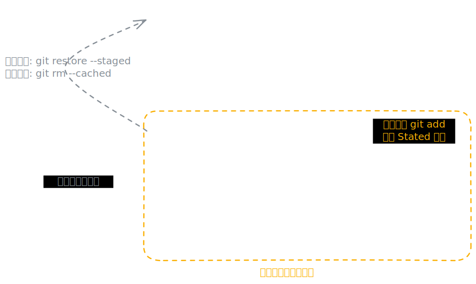

# [0012. Git 基本原理](https://github.com/tnotesjs/TNotes.git-notes/tree/main/notes/0012.%20Git%20%E5%9F%BA%E6%9C%AC%E5%8E%9F%E7%90%86)

<!-- region:toc -->

- [1. 🎯 本节内容](#1--本节内容)
- [2. 🫧 评价](#2--评价)
- [3. 🤔 Git 的数据模型是怎样的？](#3--git-的数据模型是怎样的)
  - [3.1. 核心对象模型 The Object Model](#31-核心对象模型-the-object-model)
    - [Blob（Binary Large Object）](#blobbinary-large-object)
    - [Tree（目录树）](#tree目录树)
    - [Commit（提交）](#commit提交)
    - [Tag（标签）](#tag标签)
  - [3.2. “快照流”的工作机制](#32-快照流的工作机制)
  - [3.3. 与“差异模型”（Delta-based）的对比](#33-与差异模型delta-based的对比)
  - [3.4. 小结](#34-小结)
- [4. 🤔 如何查看 Git 仓库的状态？](#4--如何查看-git-仓库的状态)
- [5. 🤔 Git 的工作区域是如何划分的？](#5--git-的工作区域是如何划分的)
- [6. 🤔 Git 文件都有哪些状态？](#6--git-文件都有哪些状态)
- [7. 🤔 Git 文件的状态是如何流转的？](#7--git-文件的状态是如何流转的)

<!-- endregion:toc -->

## 1. 🎯 本节内容

- Git 的数据模型（快照，而非差异）
- Git 的三种状态（已修改、已暂存、已提交）
- Git 的工作区域（工作区、暂存区、版本库）
- Git 对象（Blob、Tree、Commit）与 SHA-1 校验和

## 2. 🫧 评价

重点内容：

- Git 的三种状态（已修改、已暂存、已提交）
- Git 的工作区域（工作区、暂存区、版本库）

## 3. 🤔 Git 的数据模型是怎样的？

Git 与其他版本控制系统最大的区别在于它对待数据的方式。传统系统（如 SVN）存储的是文件差异（delta） —— 即每个版本相对于上一个版本的改动。而 Git 存储的是快照（snapshot） —— 每次提交时，Git 会对当前所有文件的状态做一次快照，并保存一个指向该快照的引用。

如果某个文件没有被修改，Git 不会重新存储该文件，而是保留一个指向之前已存储文件的链接，这样既保证了完整性，又不会浪费空间。

这种“快照流”的设计使得 Git 在分支切换、历史对比等操作上都非常高效。

如果想对 Git 的数据模型有更深入的理解，我们可以从以下几个核心层面来展开：

### 3.1. 核心对象模型 The Object Model

Git 的底层是一个内容寻址文件系统，Git 数据库（`.git` 目录）中存储的所有内容都可以归结为四种基本对象类型：

| 对象类型 | 描述 |
| --- | --- |
| Blob 对象 | 存储文件的内容（不包含文件名等元信息） |
| Tree 对象 | 类似目录，记录 Blob 对象和其他 Tree 对象的引用，包含文件名和目录结构 |
| Commit 对象 | 记录一次提交的信息，包括指向顶层 Tree 对象的指针、作者、提交者、提交消息以及父提交的引用 |
| Tag 对象 | 指向特定 Commit 的带注释的标签 |

每个对象都通过 SHA-1（或在新版本中逐渐过渡到 SHA-256）哈希值进行寻址和验证完整性（一个 40 位的十六进制字符串）来唯一标识。例如：

```
24b9da6552252987aa493b52f8696cd6d3b00373
```

这种基于内容的寻址机制确保了数据的完整性 —— 任何内容的改变都会导致校验和不同。

#### Blob（Binary Large Object）

- 含义：代表文件的内容。
- 特点：它只存储文件数据，不存储文件名。如果两个文件内容完全相同，它们在 Git 中只会对应同一个 Blob 对象（这就是你提到的“保留指向之前已存储文件的链接”的底层实现）。

#### Tree（目录树）

- 含义：代表一个目录（文件夹）。
- 特点：它存储了文件名、文件权限以及指向 Blob（文件）或其他 Tree（子目录）的引用。你可以把它理解为 Unix 文件系统中的一个目录条目。
- 快照的本质：一次提交（Commit）所对应的“快照”，本质上就是一个顶级的 Tree 对象。这个 Tree 递归地包含了该项目在该时刻所有文件和目录的结构。

#### Commit（提交）

- 含义：代表项目历史中的一个节点。
- 特点：它包含：
  1. 指向顶级 Tree 对象的指针（即该次提交的快照）。
  2. 指向父 Commit 对象的指针（如果是合并提交，则有多个父节点）。
  3. 元数据（作者、提交者、时间戳、提交信息）。
- 关键点：Commit 对象本身不包含任何文件内容的变更，它只是指向那个时刻整个项目状态的“书签”。

#### Tag（标签）

- 含义：给特定的 Commit 打上一个易读的名字（如 `v1.0`）。
- 特点：类似于 Commit 指向 Tree，Tag 指向一个 Commit。

### 3.2. “快照流”的工作机制

当你执行 `git commit` 时，Git 做了以下事情：

1. 计算 Blob：检查暂存区（Index）中的文件。如果文件内容没变，直接复用现有的 Blob 哈希；如果变了，创建新的 Blob。
2. 构建 Tree：创建一个新的 Tree 对象，记录当前目录结构，指向最新的 Blobs 和子 Trees。
3. 创建 Commit：创建一个新的 Commit 对象，指向这个新的 Tree，并记录父 Commit 的哈希。

效率来源：由于 Tree 对象是指向 Blob 的引用，如果某个大文件在两次提交间没有变化，新的 Tree 会直接指向旧的 Blob 哈希。这意味着：

- 存储空间：无论历史多长，未修改的大文件在磁盘上只存一份。
- 分支切换：切换分支只是改变 `HEAD` 指针指向不同的 Commit，进而加载不同的 Tree。因为大部分文件（Blob）是共享的，操作系统无需大量读写磁盘，速度极快。

想象一下 Git 的历史不是线性的文件修改记录，而是一系列文件系统镜像的链表：

```text
Commit A (Hash: abc123)
  |
  +-> Tree (Hash: treeA)
        +-> file1.txt -> Blob (Hash: blob1)  "Hello"
        +-> file2.txt -> Blob (Hash: blob2)  "World"

Commit B (Hash: def456) [修改了 file2.txt]
  |
  +-> Parent: abc123
  +-> Tree (Hash: treeB)
        +-> file1.txt -> Blob (Hash: blob1)  <-- 指向同一个 Blob (未变)
        +-> file2.txt -> Blob (Hash: blob3)  "Universe" (新 Blob)
```

在这个例子中，Commit B 并没有存储“file2.txt 从 World 变为 Universe”的指令，而是存储了一个全新的目录结构（treeB），其中 file1.txt 依然指向旧的 blob1，而 file2.txt 指向新的 blob3。

### 3.3. 与“差异模型”（Delta-based）的对比

| 特性 | Git（快照模型） | SVN/CVS（差异模型） |
| :-- | :-- | :-- |
| 存储单元 | 整个项目的状态快照（Tree + Blobs） | 文件级别的增量补丁（Diffs） |
| 文件重命名 | 天然支持（因为是基于内容哈希，改名后内容不变，Blob 不变） | 通常需要显式记录重命名操作，否则视为删除+新建 |
| 完整性 | 极高。任何比特位的损坏都会导致哈希值变化，Git 会立即报错 | 较低。差异链中某一步损坏可能导致后续所有版本无法恢复 |
| 离线操作 | 完整的历史库都在本地，可随意查看历史、对比、分支 | 大多需要连接服务器才能查看完整历史或进行复杂操作 |
| 数据冗余 | 看似冗余（每次存全量），实则通过哈希去重，空间效率极高 | 看似节省（只存差异），但在处理二进制文件或复杂分支合并时效率较低 |

### 3.4. 小结

Git 的设计哲学是：将版本控制问题转化为文件系统快照的管理问题。这种基于内容寻址（Content-Addressable Storage）的快照模型，不仅保证了数据的绝对完整性，还使得分布式协作、分支管理和历史回溯变得异常高效和灵活。

## 4. 🤔 如何查看 Git 仓库的状态？

切换到 git 仓库所在位置，执行以下命令：

```bash
git status
```

示例：

```bash
git status
# On branch main
# Your branch is up to date with 'origin/main'.

# Changes not staged for commit:
#   (use "git add <file>..." to update what will be committed)
#   (use "git restore <file>..." to discard changes in working directory)
#         modified:   .vscode/settings.json
#         modified:   "notes/0012. Git \345\237\272\346\234\254\345\216\237\347\220\206/README.md"

# no changes added to commit (use "git add" and/or "git commit -a")
```

上述输出结果中，提示有两个文件的状态是 `modified`，表示当前 git 仓库中这两个文件被修改了。

## 5. 🤔 Git 的工作区域是如何划分的？

Git 项目有三个主要区域，对应文件的三种状态：

- 工作区（Working Directory）：从 `.git` 目录中提取出来的某个版本的文件，放在磁盘上供你编辑和使用
- 暂存区（Staging Area / Index）：一个文件，保存了下次提交时将要包含的文件快照信息，位于 `.git/index`
- Git 目录（Repository / `.git`）：Git 用来保存项目元数据和对象数据库的地方，是 Git 最重要的部分

```
工作区 -- git add --> 暂存区 -- git commit --> Git 目录
```

理解这三个区域的关系，是掌握 Git 的关键。

## 6. 🤔 Git 文件都有哪些状态？

Git 管理的文件根据其在工作区、暂存区和版本库 中的位置，共有 4 种核心状态：

| 状态 | 描述 |
| :-- | :-- |
| `Untracked` -> 未跟踪 | 新创建的文件。Git 尚未开始管理它，它只存在于工作区，不在暂存区或版本库中。 |
| `Modified` -> 已修改 | 文件已被 Git 跟踪，但工作区的内容发生了变动，且这些变动尚未被放入暂存区。 |
| `Staged` -> 已暂存 | 已修改的文件通过 `git add` 被标记，其当前快照已放入暂存区，准备包含在下一次提交中。 |
| `Committed` -> 已提交 | 数据已通过 `git commit` 永久安全地存储在本地 Git 数据库（版本库）中。 |

## 7. 🤔 Git 文件的状态是如何流转的？



完整状态流转流程：

1. 新建文件 -> 文件处于未跟踪 (`Untracked`) 状态。
2. 执行 `git add` -> 文件被纳入管理，进入已暂存 (`Staged`) 状态。注：如果是已跟踪的文件被修改，执行 `git add` 会将其从“已修改”更新为“已暂存”。
3. 执行 `git commit` -> 暂存区的数据被写入仓库，文件变为已提交 (`Committed`) 状态。
4. 再次修改文件 -> 文件相对于版本库发生变化，进入已修改 (`Modified`) 状态，等待下一次循环。

`Untracked` 是文件生命周期的起点；而 `Modified`、`Staged`、`Committed` 则是文件在被 Git 跟踪后的循环状态。
