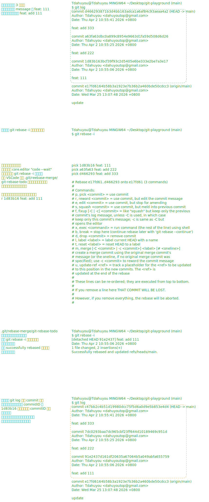
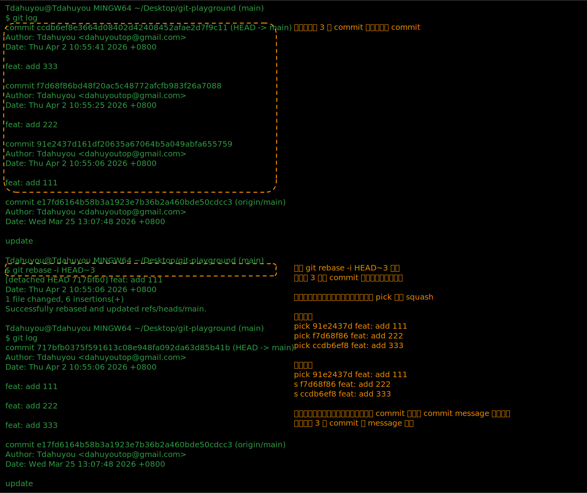

# [0027. 交互式变基](https://github.com/tnotesjs/TNotes.git-notes/tree/main/notes/0027.%20%E4%BA%A4%E4%BA%92%E5%BC%8F%E5%8F%98%E5%9F%BA)

<!-- region:toc -->

- [1. 🎯 本节内容](#1--本节内容)
- [2. 🫧 评价](#2--评价)
- [3. 🤔 如何修改历史提交信息？](#3--如何修改历史提交信息)
- [4. 🤔 如何压缩提交？](#4--如何压缩提交)
  - [4.1. squash](#41-squash)
  - [4.2. fixup](#42-fixup)
- [5. 🤔 如何编辑与拆分提交？](#5--如何编辑与拆分提交)
  - [5.1. 修改提交内容](#51-修改提交内容)
  - [5.2. 拆分提交为多个](#52-拆分提交为多个)
- [6. 🤔 如何删除与排序提交？](#6--如何删除与排序提交)
  - [6.1. 删除提交](#61-删除提交)
  - [6.2. 排序提交](#62-排序提交)

<!-- endregion:toc -->

## 1. 🎯 本节内容

- 修改历史提交信息（`reword`）
- 压缩提交（`squash` / `fixup`）
- 编辑与拆分提交（`edit`）
- 删除与排序提交

## 2. 🫧 评价

可以不用刻意去记操作关键字，比如 `pick`、`reword`、`squash` ... 因为在执行交互式变基操作的时候，会有内置的注释提示告知你应该如何修改参数，每个参数的含义分别是什么。

交互式变基可用的完整指令列表：

| 指令     | 简写 | 说明                         |
| -------- | ---- | ---------------------------- |
| `pick`   | `p`  | 保留提交不变                 |
| `reword` | `r`  | 修改提交消息                 |
| `edit`   | `e`  | 暂停以修改提交               |
| `squash` | `s`  | 合并到前一个提交（保留消息） |
| `fixup`  | `f`  | 合并到前一个提交（丢弃消息） |
| `drop`   | `d`  | 删除提交                     |
| `exec`   | `x`  | 执行 shell 命令              |

## 3. 🤔 如何修改历史提交信息？

使用交互式变基的 `reword` 指令可以修改历史提交的消息：

```bash
# 修改最近 3 次提交
git rebase -i HEAD~3
```

执行后会打开编辑器，显示提交列表：

```
pick abc1234（这是 commitID） 第一次提交的 commit message
pick def5678（这是 commitID） 第二次提交的 commit message
pick ghi9012（这是 commitID） 第三次提交的 commit message
```

排在最前边儿的是最旧的（最早提交的），排在结尾的时最新的（最近提交的）。

找到你需要修改 commit message 的提交，将修改消息的提交前的指令 `pick` 改为 `reword`（或简写为 `r`），重写提交消息。

```
pick abc1234 第一次提交的 commit message
reword def5678 第二次提交的 commit message
pick ghi9012 第三次提交的 commit message
```

保存退出后，Git 会依次打开编辑器让你修改对应提交的消息。

注意：修改历史提交信息会重写被修改提交及其后续所有提交的 SHA-1 值，因此只应对未推送的提交使用，如果改的是已推送到远程仓库的提交，会导致历史被破坏，进而导致你和其它协作者的历史版本不统一。

示例：



## 4. 🤔 如何压缩提交？

压缩提交可以将多个相关的提交合并为一个，保持提交历史的简洁。交互式变基提供两种压缩方式：

### 4.1. squash

将提交合并到前一个提交中，保留两个提交的消息供你编辑：

```
pick abc1234 添加用户模型
squash def5678 修复用户模型的字段
squash ghi9012 补充用户模型的验证
```



### 4.2. fixup

与 `squash` 类似，但会丢弃被压缩提交的消息，只保留第一个提交的消息：

```
pick abc1234 添加用户模型
fixup def5678 修复用户模型的字段
fixup ghi9012 补充用户模型的验证
```

使用 `fixup` 的快捷方式——在提交时使用 `--fixup` 参数：

```bash
# 创建一个标记为 fixup 的提交
git commit --fixup=abc1234

# 自动变基，将 fixup 提交合并
git rebase -i --autosquash HEAD~5
```

## 5. 🤔 如何编辑与拆分提交？

使用 `edit` 指令可以暂停在某个提交上，进行修改或拆分：

```
pick abc1234 第一次提交
edit def5678 这个提交需要拆分
pick ghi9012 第三次提交
```

Git 会在 `def5678` 处暂停。此时你可以：

### 5.1. 修改提交内容

```bash
# 修改文件
# ...
git add .
git commit --amend
git rebase --continue
```

### 5.2. 拆分提交为多个

```bash
# 重置当前提交（保留修改在工作区）
git reset HEAD~1

# 分别暂存和提交
git add file1.txt
git commit -m "拆分后的第一个提交"

git add file2.txt
git commit -m "拆分后的第二个提交"

# 继续变基
git rebase --continue
```

## 6. 🤔 如何删除与排序提交？

在交互式变基的编辑器中：

### 6.1. 删除提交

直接删除对应的行，或将 `pick` 改为 `drop`：

```
pick abc1234 保留这个提交
drop def5678 删除这个提交
pick ghi9012 保留这个提交
```

注意：如果删除的是中间的提交，可能会导致冲突，如果删除的是最新的提交，一般不会有冲突，相当于回退到前一个版本。

### 6.2. 排序提交

直接调整行的顺序即可改变提交顺序：

```
# 原始顺序
pick abc1234 功能 A
pick def5678 功能 B
pick ghi9012 功能 C

# 调整为
pick ghi9012 功能 C
pick abc1234 功能 A
pick def5678 功能 B
```

注意：调整提交顺序可能会引发冲突，特别是当后面的提交依赖前面的提交时。
